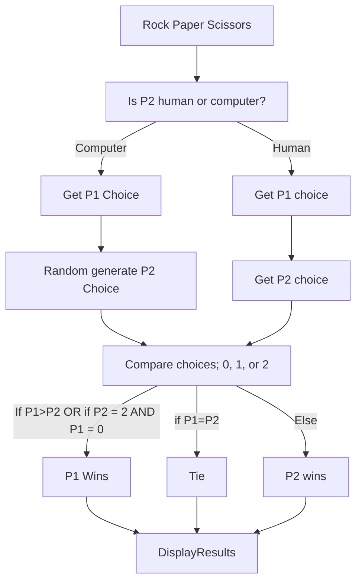

```mermaid

flowchart TD
    A[Rock Paper Scissors] --> B[Is P2 human or computer?]
    B --Human--> C[Get P1 choice]
    C --> D[Get P2 choice]
    B--Computer-->E[Get P1 Choice]
    E--> F[Random generate P2 Choice] 
    F-->G[Compare choices; 0, 1, or 2]
    D-->G[Compare choices; 0, 1, or 2]
    
    G -- If P1>P2 OR if P2 = 2 AND P1 = 0 -->H[P1 Wins]
    G -- if P1=P2 -->I[Tie]
    G -- Else -->J[P2 wins]
    H --> K[DisplayResults]
    I --> K
    J --> K

```
