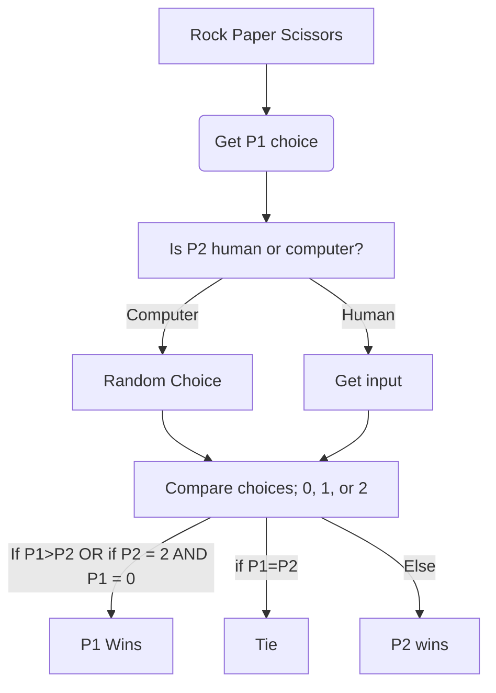

```mermaid

flowchart TD
    A[Rock Paper Scissors] --> B(Get P1 choice)
    B --> C[Is P2 human or computer?]
    C--Human -->D[Get input] 
    C--Computer-->E[Random Choice]
    E-->F[Compare choices; 0, 1, or 2]
    D-->F[Compare choices; 0, 1, or 2]
    
    F -- If P1>P2 OR if P2 = 2 AND P1 = 0 -->G[P1 Wins]
    F -- if P1=P2 -->H[Tie]
    F -- Else -->I[P2 wins]

```
