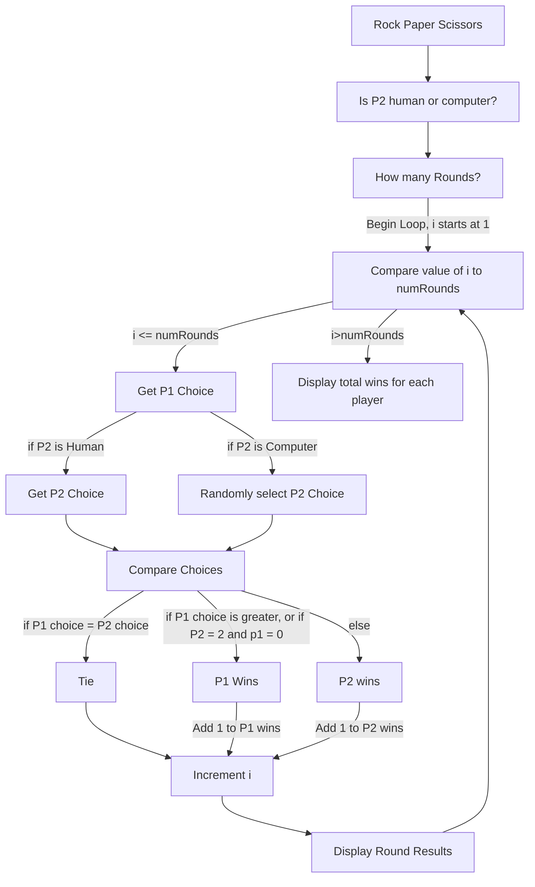

```mermaid
  flowchart TD
    A[Rock Paper Scissors] --> B[Is P2 human or computer?]
    B --> C[How many Rounds?]
    C --Begin Loop, i starts at 1-->D[Compare value of i to numRounds]
    D -- i <= numRounds --> E[Get P1 Choice]
    E -- if P2 is Human --> F[Get P2 Choice]
    E -- if P2 is Computer --> G[Randomly select P2 Choice]
    F --> H[Compare Choices]
    G --> H
    H -- if P1 choice = P2 choice --> I[Tie]
    H -- if P1 choice is greater, or if P2 = 2 and p1 = 0 --> J[P1 Wins]
    H -- else --> K[P2 wins]
    I --> L[Increment i]
    J --Add 1 to P1 wins-->L
    K --Add 1 to P2 wins-->L
    L --> M[Display Round Results] -->D
    D -- i>numRounds --> N[Display total wins for each player]
```
